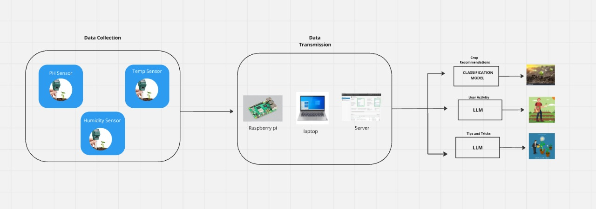

# AGRISENSE: Smart Agriculture Solution

## 1. Brief Introduction

Uran Sprout is a smart agriculture solution that leverages real-time soil data to guide farmers in making informed decisions about crop selection and cultivation strategies. The system collects data such as pH, temperature, and moisture levels using sensors connected to a NodeMCU. This data is sent to a central server, where an application processes the inputs and provides recommendations on optimal crops, fertilizer usage, and methods to maximize yield. Additionally, the platform offers routine plans for selected crops and real-time suggestions during unexpected scenarios.

---

## 2. Workflow Diagram

## 3. Concept Map

### Data Collection:
- Sensors collect soil pH, temperature, and moisture levels.
- NodeMCU transmits the data to the server.

### Data Processing:
- Backend processes the data using models to generate actionable insights.

### Recommendations:
- Suggests suitable crops.
- Proposes fertilizer requirements.
- Develops a routine 30-day plan for optimal growth.

### Real-Time Assistance:
- Provides emergency solutions based on user queries.

---

## 4. Tech Stack

### Frontend:
- React with Vite for a fast, responsive user interface.

### Backend:
- FastAPI for efficient and scalable data processing.

### Hardware:
- NodeMCU for transmitting sensor data.
- Soil sensors for measuring pH, temperature, and moisture levels.

### Others:
- GitHub for version control.

---

## 5. Novelty

- **Low-Cost Design** Affordable components ensure accessibility for small-scale farmers.  
- **Real-Time Insights** Delivers up-to-date data on soil health for informed decision-making.
- **Personalized Tips and Alerts** Provides tailored recommendations and timely notifications.
- **Sustainability Support** Optimizes water and fertilizer use to promote eco-friendly farming.
- **Actionable Recommendations** Offers clear, practical steps to enhance yield and soil quality.

---

## 6. Solution

### Uran Sprout 🌱

Uran Sprout is a precision agriculture system that optimizes crop yield on small land parcels by leveraging real-time soil data and smart analytics.

---

### Key Features
- Real-Time Monitoring: Tracks pH, temperature, and moisture.  
- Crop Suggestions: Recommends suitable crops based on soil data.  
- Yield Optimization: Provides techniques for better productivity.  
- Automated Management: Controls water and fertilizer levels.

---

### Why Uran Sprout?
Empowers farmers with technology for sustainable and efficient farming practices, even on limited land.

## 7. Others

### Future Scope:

- Expanding sensor capabilities to measure additional parameters like soil salinity and nutrient levels.
- Integrating machine learning models to predict long-term yield trends.
- Adding multilingual support to cater to diverse farming communities.

### How to Contribute:

1. Clone the repository.
2. Set up the development environment following the instructions in the CONTRIBUTING.md.
3. Submit your changes via a pull request.

